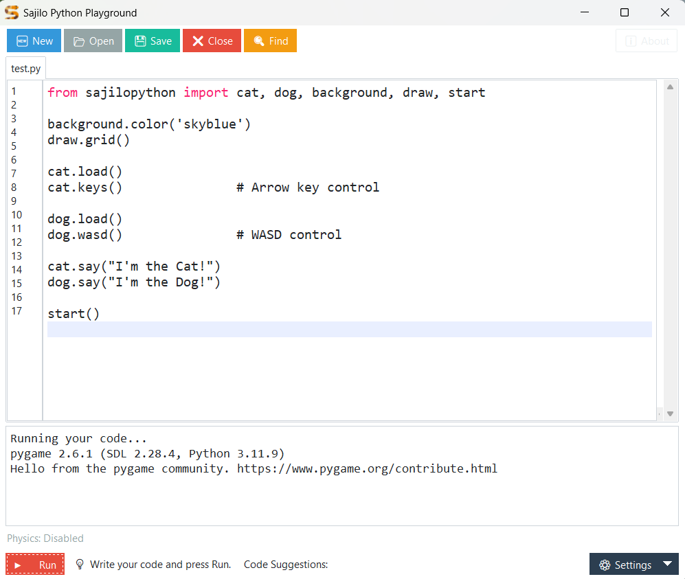

# SajiloPython

**SajiloPython** is a beginner-friendly Python library designed for kids and early learners to create interactive games, animations, and creative projects with ease. Built on top of Pygame, SajiloPython provides simple commands for controlling characters, playing sounds, loading backgrounds, drawing shapes, and more — all in a fun, engaging way.

---

## 🖥️ Sajilo Python Playground IDE

We also provide the **Sajilo Python Playground IDE**, designed specifically to help students easily load and run:
- **SajiloPython**
- **SajiloPyGame**
- **SajiloCV**

This lightweight IDE works even on older, low-spec hardware, making coding accessible to everyone. It supports theme selection, syntax highlighting, and allows quick code execution without heavy system requirements.

### 🖼️ Screenshot of Sajilo Python Playground IDE:



---

## 🚀 Features

- Easy-to-use commands like:
  - `cat.move_left(5)`, `dog.jump(150)`, `parrot.say("Hello!")`
- Background support:
  - `background.load('space')`, `background.color('lightblue')`, `background.opacity(200)`
- Sound management:
  - `sound.load('meow')`, `sound.loop('music')`, `sound.volume(5)`, `sound.stop()`
- Draw shapes:
  - `draw.line()`, `draw.rectangle()`, `draw.circle()`, `draw.ellipse()`, `draw.arc()`, `draw.polygon()`, `draw.grid()`
- Animate shapes like rectangles and circles just like characters!
- Automatic asset detection from folders:
  - Characters: `assets/characters/`
  - Backgrounds: `assets/backgrounds/`
  - Sounds: `assets/sounds/`

---

## 🐍 Example Usage

```python
from sajilopython import cat, dog, background, sound, draw, start

background.color('skyblue')
cat.load()
cat.keys()

dog.load()
dog.wasd()

draw.grid()
sound.loop('background_music')
start()
```

---

## 📝 License

This project is licensed under the MIT License. See the `LICENSE` file for details.

---

## ❤️ Acknowledgments

Made with love for young learners by the **SajiloPython Team**.
